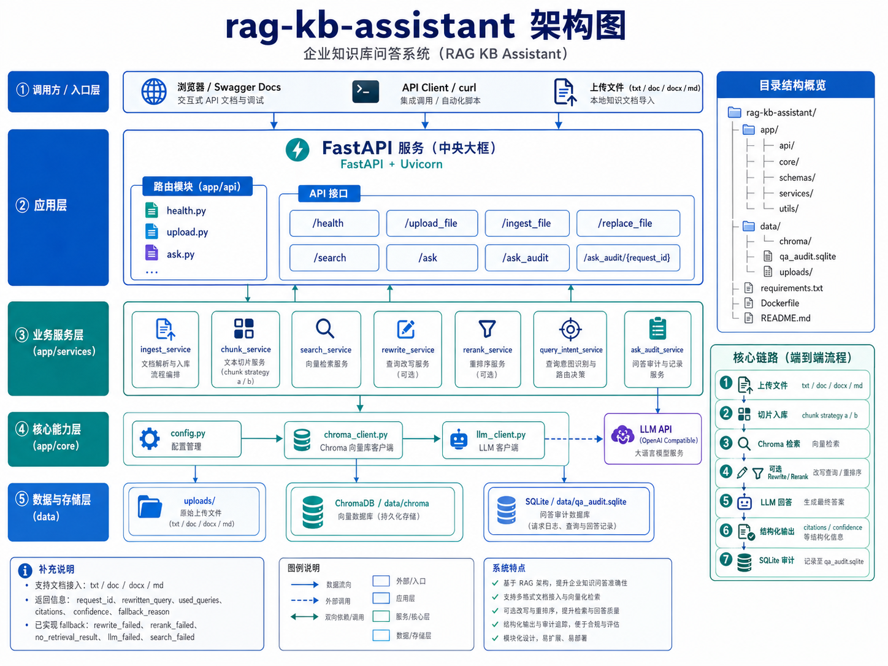

# 理赔知识库问答助手（RAG KB Assistant）


一个面向理赔知识问答与工单辅助场景的轻量级 RAG 项目。当前版本已经覆盖：

- 文档上传、切片入库、向量检索、证据驱动问答
- `chunk strategy a / b` 两套切片策略
- Query Rewrite 与 Light Rerank
- `/ask` 的 SQLite 审计记录
- 异常处理与降级
- `citations / confidence` 结构化输出


## 项目定位

这个项目默认服务于理赔类知识场景，例如：

- 住院、门诊、报案、补件等流程问题
- 材料清单、条款边界、赔付规则说明
- FAQ / 规则说明 / SOP / 工单案例摘要类语料问答

当前主链路如下：

```text
上传文件 -> 切片入库 -> Chroma 检索 -> 可选 Rewrite / Rerank -> LLM 回答 -> SQLite 审计
```

## 当前能力

### 1. 文档接入

- `POST /upload_file`
  - 支持 `.txt`、`.docx`、`.doc`、`.md`
  - 空文件会直接返回 `400`
- `POST /ingest_file`
  - 支持切片策略 `a / b`
  - 文件不存在、编码错误、空文本会直接中断
- `POST /replace_file`
  - 用新文件替换已入库文档
  - 支持保留旧 `doc_id` 或切换到新 `doc_id`

### 2. 检索与问答

- `GET /search`
  - 支持 `kb_id` 过滤
  - 支持 `use_rewrite`
  - 支持切换 `collection_name`
- `POST /ask`
  - 先检索，再基于上下文问答
  - 返回 `request_id`
  - 返回 `rewritten_query / used_queries / rewrite_hints`
  - 返回 `citations / confidence`
  - 返回 `fallback_reason / fallback_reasons`

### 3. 审计与降级

- `/ask` 会把关键摘要写入 `data/qa_audit.sqlite`
- 提供只读查询接口：
  - `GET /ask_audit`
  - `GET /ask_audit/{request_id}`
- 已实现的 fallback：
  - `rewrite_failed`：回退原始 query
  - `rerank_failed`：回退原始召回顺序
  - `no_retrieval_result`：不调用 LLM，直接返回未命中提示
  - `llm_failed`：返回模型兜底文案，并保留检索结果
  - `search_failed`：返回检索兜底文案

## 技术栈

- Python 3.11
- FastAPI
- Uvicorn
- Pydantic
- ChromaDB
- OpenAI Python SDK
- jieba
- python-docx
- SQLite（使用标准库 `sqlite3`）

## 目录结构

```text
rag-kb-assistant/
├── app/
│   ├── api/
│   │   ├── ask.py
│   │   ├── health.py
│   │   └── upload.py
│   ├── core/
│   │   ├── chroma_client.py
│   │   ├── config.py
│   │   └── llm_client.py
│   ├── schemas/
│   │   ├── ask.py
│   │   └── upload.py
│   ├── services/
│   │   ├── ask_audit_service.py
│   │   ├── chunk_service.py
│   │   ├── ingest_service.py
│   │   ├── query_intent_service.py
│   │   ├── rerank_service.py
│   │   ├── rewrite_service.py
│   │   └── search_service.py
│   └── utils/
├── data/
│   ├── chroma/
│   ├── qa_audit.sqlite
│   └── uploads/
├── requirements.txt
├── sample_claim.txt
└── README.md
```

说明：

- 真正挂到 FastAPI 的路由只有 `health / upload / ask`
- Chroma 的本地持久化路径是 `data/chroma`
- ask 审计 SQLite 路径是 `data/qa_audit.sqlite`

## 快速启动

### 1. 创建虚拟环境

```bash
python -m venv .venv
```

Windows：

```bash
.venv\Scripts\activate
```

macOS / Linux：

```bash
source .venv/bin/activate
```

### 2. 安装依赖

```bash
pip install -r requirements.txt
```

### 3. 配置模型环境变量

复制 `.env.example` 为 `.env`，至少配置：

```env
MODEL_API_KEY=your_api_key
MODEL_BASE_URL=https://api.openai.com/v1
MODEL_NAME=gpt-4o-mini
```

### 4. 启动服务

```bash
uvicorn app.main:app --reload
```

默认地址：

- 服务：`http://127.0.0.1:8000`
- Swagger：`http://127.0.0.1:8000/docs`

## 快速体验

### 1. 上传文件

```bash
curl -X POST "http://127.0.0.1:8000/upload_file" \
  -F "file=@sample_claim.txt" \
  -F "kb_id=claim-demo"
```

### 2. 入库

如果你后面要直接用 `/ask` 测试，建议这里使用 `strategy="b"`，因为当前 `/ask` 默认读取的是 `claim_kb_b`。

```json
{
  "saved_path": "data/uploads/xxx_sample_claim.txt",
  "kb_id": "claim-demo",
  "strategy": "b"
}
```

### 3. 问答

```json
{
  "question": "住院报销通常需要准备哪些材料？",
  "top_k": 3,
  "use_rewrite": true
}
```

示例响应：

```json
{
  "request_id": "f4a2239f-b031-4942-ab2e-ded08ffc83b1",
  "question": "住院报销通常需要准备哪些材料？",
  "answer": "根据当前命中的文档内容，住院理赔通常需要提供发票、费用明细和诊断证明。",
  "snippets": [
    "住院理赔通常需要提供发票、费用明细和诊断证明。"
  ],
  "sources": [
    {
      "file_name": "faq.md",
      "chunk_id": "c1"
    }
  ],
  "distances": [
    0.12
  ],
  "rewritten_query": "住院理赔需要提交哪些材料",
  "used_queries": [
    "住院报销通常需要准备哪些材料？",
    "住院理赔需要提交哪些材料"
  ],
  "rewrite_hints": [],
  "citations": [
    {
      "doc_id": "faq_01",
      "file_name": "faq.md",
      "chunk_id": "c1",
      "snippet": "住院理赔通常需要提供发票、费用明细和诊断证明。",
      "distance": 0.12
    }
  ],
  "confidence": "medium",
  "fallback_reason": null,
  "fallback_reasons": []
}
```

### 4. 查询 ask 审计

查看最近记录：

```bash
curl "http://127.0.0.1:8000/ask_audit?limit=5"
```

按 `request_id` 查看详情：

```bash
curl "http://127.0.0.1:8000/ask_audit/f4a2239f-b031-4942-ab2e-ded08ffc83b1"
```

## 核心接口

### `GET /health`

健康检查。

### `POST /upload_file`

上传原始文件并落盘。

请求：

- `file`：上传文件
- `kb_id`：知识库标识

### `POST /ingest_file`

读取已上传文件并入库。

请求体：

- `saved_path`
- `kb_id`
- `strategy`：`a` 或 `b`
- `doc_type_override`：可选

### `POST /replace_file`

替换已入库文档。

请求体：

- `saved_path`
- `kb_id`
- `strategy`
- `old_doc_id`
- `new_doc_id`：可选
- `doc_type_override`：可选

### `GET /search`

直接执行检索。

查询参数：

- `q`
- `kb_id`：可选
- `n_results`：默认 `3`
- `collection_name`：默认 `claim_kb_b`
- `use_rewrite`：默认 `false`

### `POST /ask`

执行检索增强问答。

请求体：

- `question`
- `top_k`：默认 `3`
- `use_rewrite`：默认 `false`

返回重点：

- `answer`
- `citations`
- `confidence`
- `fallback_reason / fallback_reasons`

### `GET /ask_audit`

查询 ask 审计记录。

查询参数：

- `limit`：默认 `20`
- `status`：可选，`success / no_retrieval / error`
- `fallback_reason`：可选

### `GET /ask_audit/{request_id}`

查询单条 ask 审计记录。

## 审计表字段

`ask_audit` 当前固定记录：

- `request_id`
- `created_at`
- `status`
- `question`
- `answer`
- `top_k`
- `use_rewrite`
- `rewritten_query`
- `used_queries_json`
- `retrieval_count`
- `sources_json`
- `distances_json`
- `citations_json`
- `confidence`
- `latency_ms`
- `fallback_reason`
- `error_type`
- `error_message`

说明：

- 通过接口读取时，`used_queries_json / sources_json / distances_json` 会直接解析成列表或对象
- `citations_json` 也会通过接口直接解析成列表
- 当前只记录 `/ask`，还没有把上传和入库统一写进 SQLite 审计表

## Confidence 与 Fallback 的关系

- `confidence` 是证据型判断，主要看 `citations` 数量和结果集中度
- `fallback_reason / fallback_reasons` 是链路诊断字段，用来说明 rewrite、rerank、llm 或检索阶段是否触发过兜底
- `rewrite_failed / rerank_failed` 不会直接拉低 `confidence`
- `no_retrieval_result / search_failed / llm_failed` 会返回 `low`，因为这几类结果没有形成可支撑答案的有效输出

## 异常处理与降级


- 上传空文件：返回 `400 上传文件为空`
- 文件类型不支持：返回 `400`
- 文件编码不是 UTF-8：入库时返回 `400`
- 文件读取失败：入库时返回 `400`
- 文本为空：入库时返回 `400`
- `rewrite` 失败：回退原始 query
- `rerank` 失败：回退原始召回顺序
- 检索为空：返回“没有检索到相关内容，暂时无法回答。”
- 检索主链路失败：返回“检索过程暂时异常，请稍后再试。”
- LLM 失败：返回“模型服务暂时不可用，请稍后再试。”

## 重要注意事项

- `/ask` 当前固定使用 `claim_kb_b`，不支持传 `kb_id` 或 `collection_name`
- 如果你用 `strategy="a"` 入库，默认只会写入 `claim_kb_a`，这批数据不会被 `/ask` 命中
- `txt / md` 文件当前按 UTF-8 读取
- Chroma 和 SQLite 都是本地持久化，适合学习、演示和单机调试

## 当前边界

- 还没有用户鉴权、权限隔离、前端页面、异步任务队列
- 还没有 Hybrid Retrieval、重试队列、统一观测平台
- SQLite 审计目前只覆盖 `/ask`

## 后续可以继续补的方向

- 给 `/ask` 增加 `kb_id` 或 `collection_name`，消除 `strategy a / b` 的使用割裂
- 把上传、入库、检索、问答四层日志统一成一套审计口径
- 增加 `answer / citations / confidence` 结构化返回
- 把 README、架构图、异常清单和评估样例进一步收口成完整面试材料
